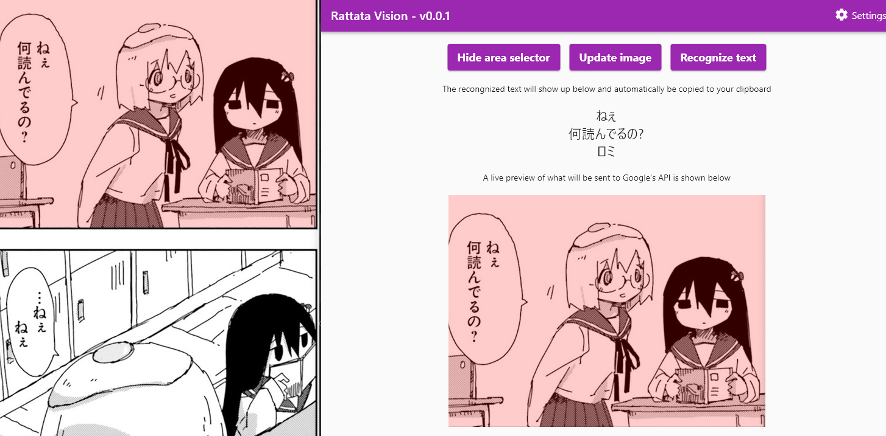
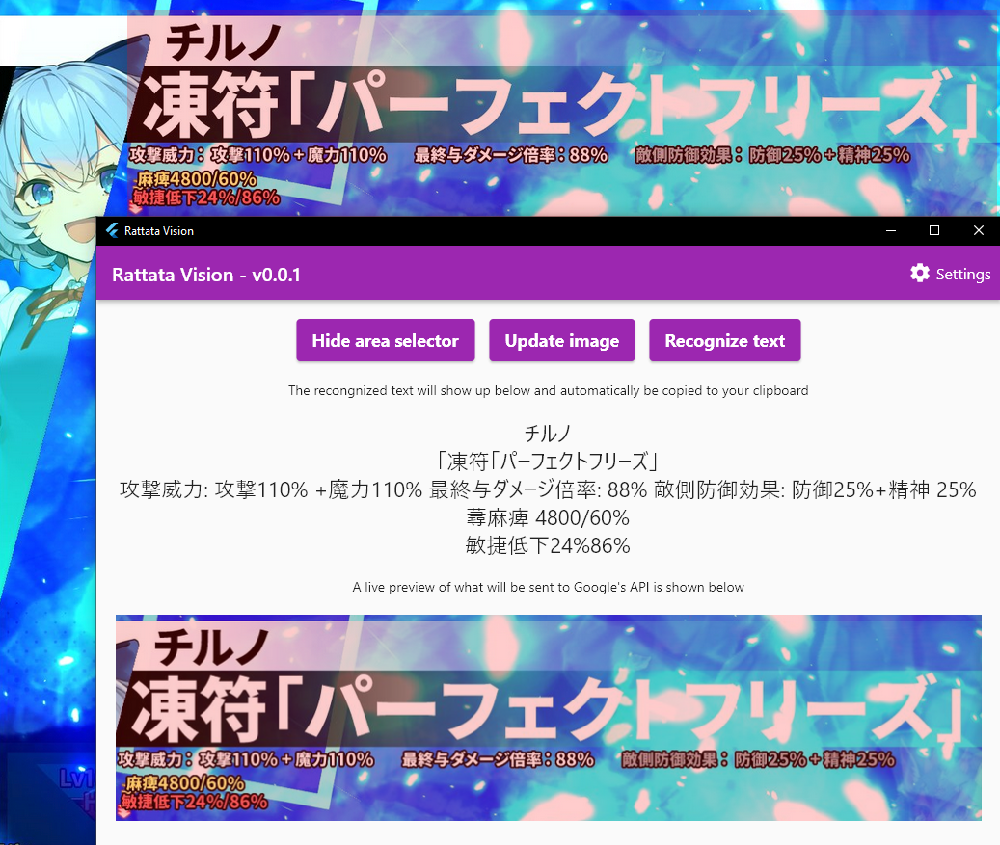
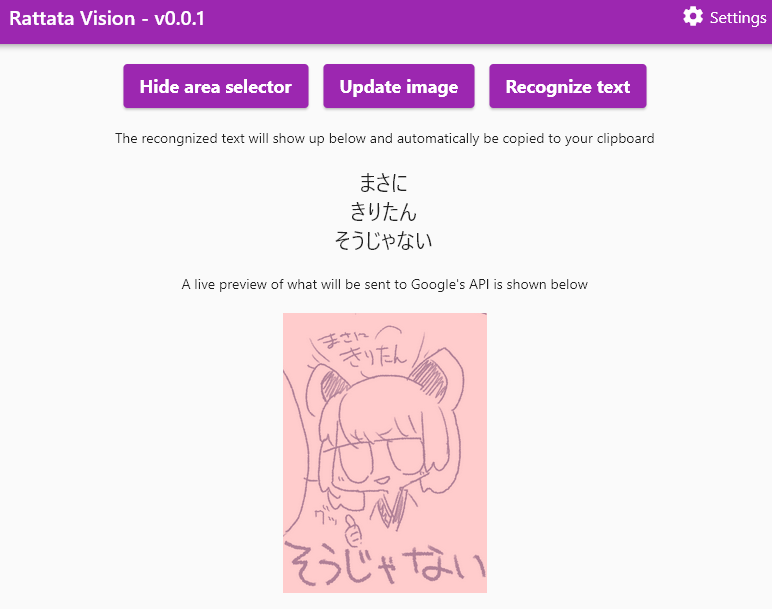
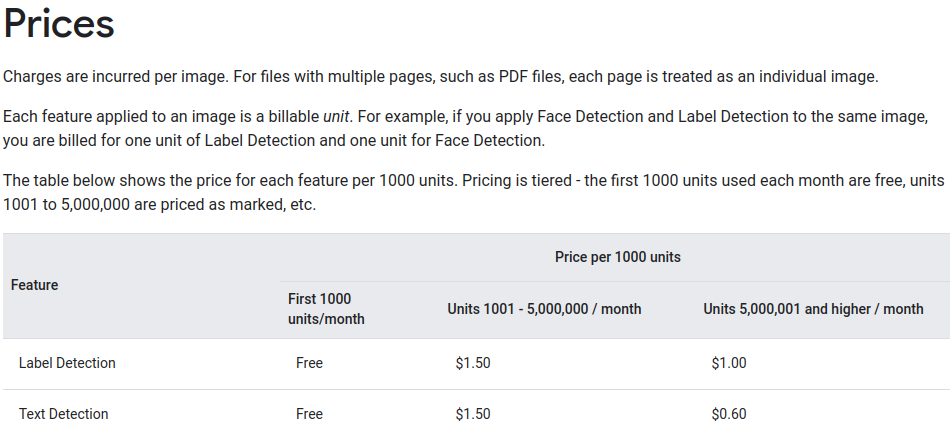
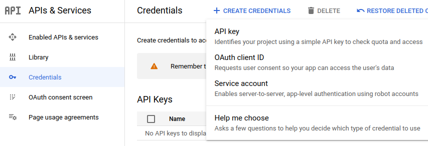
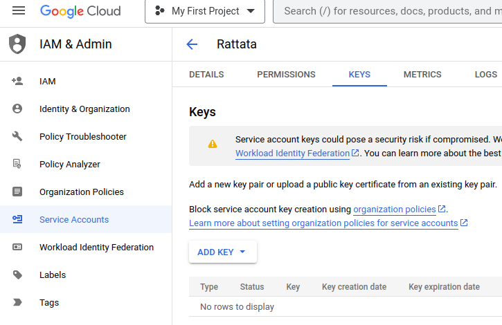
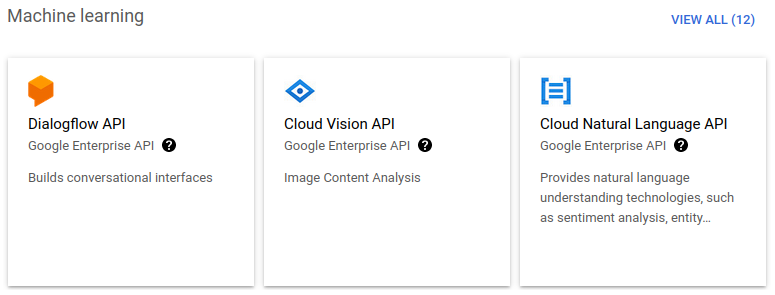
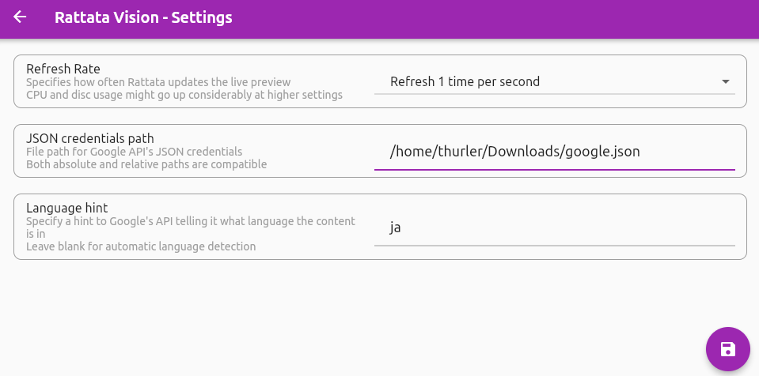
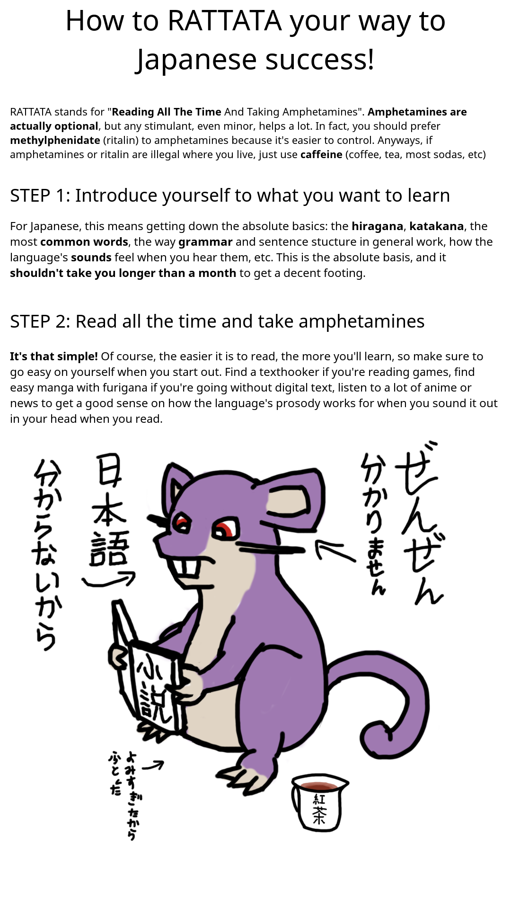

# Rattata Vision

Use Google's Vision API to detect text from anywhere on your screen. Use it to extract text from games, manga, hand-drawn art or any other media that doesn't allow you to copy its text!

## Why Rattata?

RATTATA is short for "Read All The Time And Take Amphetamines", referenced by a funny image I found on an imageboard once that provided a lasting impact on how I should learn Japanese. In the spirit of easing my way into reading manga, I developed a beta version of this tool in Python and QT, and have been using it for a while. One day I decided to rewrite it in Flutter and share it with the world. You can see the original image at the bottom of this readme.

## How does it work?

The software will periodically take screenshots of your desktop screen, and upload the latest screenshot when you hit the "Recognize text" button to Google's Vision API. Google will then do their magic to automatically detect text in the image, no matter what language.

Because your desktop screen can be filled with text from irrelevant things that you don't want Google seeing, an auxiliary translucent screen is provided to limit the screenshot area. You can easily move it around and resize it as needed, to either capture an entire game window or just a manga's speech bubble.

You can tweak how often the software takes screenshots in the settings. Generally you don't want to go above 10 screenshots per second, but faster options are provided for smoother previews. You can also specify the language you're detecting, so Google doesn't accidentally think your Japanese text is Chinese, for example.

## Is this free?

This software is provided for free, but Google's Vision API is "freemium" - you only pay if you go over your free quota. Each time you ask Google to recognize something in an image, you use up some imaginary credits. When you run out of credits, you gotta pay for more. You can check the pricing over at https://cloud.google.com/vision/pricing

1000 is a pretty generous amount, unless you're going to use this every day or something, which will limit you to like 33 requests per day. Remember you can just setup more accounts to double your free tier, with the inconvenience of having to swap between credentials being the only thing stopping you. You also get some free credits to use if you go over the 1000 free calls during your first month of use.

## Setup Guide

This software requires an integration with Google's Vision API. You must setup a project yourself and provide this software with your API credentials, a JSON file Google gives you when you set everything up. Here's a (possibly outdated) step-by-step:

- Head over to https://cloud.google.com/vision and click the "Try Vision AI free"
- Fill in Google's account information form and payment info
- Fill in some more info so they know why you're signing up
- If you're interested in keeping your credentials past the 30-day trial period, make sure to click the "Activate Full Account" button
  - This will also cause Google to automatically bill you if/when you go over the free quota
- Open the side menu and click on "APIs & Services" > "Credentials"
- Click on "Create Credentials" > "Service account" on top of the page

- Fill in the details as needed (the name doesn't really matter)
- The optional steps can be skipped too (but if you want to restrict access, feel free to)
- Click on the generated account, and head over to the "Keys" section

- Click on "Add Key" > "Create new key"
- Select JSON as your key type
- This should prompt a download of a JSON file
- Save it wherever you like AND KEEP IT SAFE
- If the key ever leaks somewhere, you can revoke its access and generate a new one at any time

- Open the side menu again and click on "APIs & Services" > "Enabled APIs & Services"
- Click on "Enable APIs and Services" on top of the page
- Scroll down to the "Machine learning" section and click on "Cloud Vision API"

- Click on the "Enable" button
- You're done messing with Google's dashboards!
- Make sure you open the "Settings" view in this software and configure everything properly

### Extra steps for Linux users

Linux users should install `scrot` from their package manager. This is the behind-the-scenes tool that takes screenshots of your desktop screen. It is also a VERY useful tool for everyday use, so you should install it regardless.

## Contributing

If you want to help make this software better, here's a TODO list of things I think are useful but have no time or willpower to code:

- Automatically detect when there is new text in the capture area, to automatically upload the new image to Google
  - If you just upload once per second, you'll hit your free quota pretty fast!
- Integrate with a translation tool so that text is automatically translated too
  - Could be nice to remove the whole Alt+Tab in and out of a translator
- Stop using a temporary file on disc to zero disc usage - keep everything in RAM
  - This would not only speedup the application, but also prevent constant writing and reading on the user's poor disc
- Add support for MacOS devices
  - I do not have a Mac to test screenshot integrations - does `scrot` even work in MacOS?
- Add support for Android / iOS devices
  - I have no idea how to make this idea work for mobile - suggestions welcome!

If you encounter problems with the software, feel free to open an issue, and I'll try to address it whenever I have free time. Remember this is a hobby project.

## The original RATTATA image

